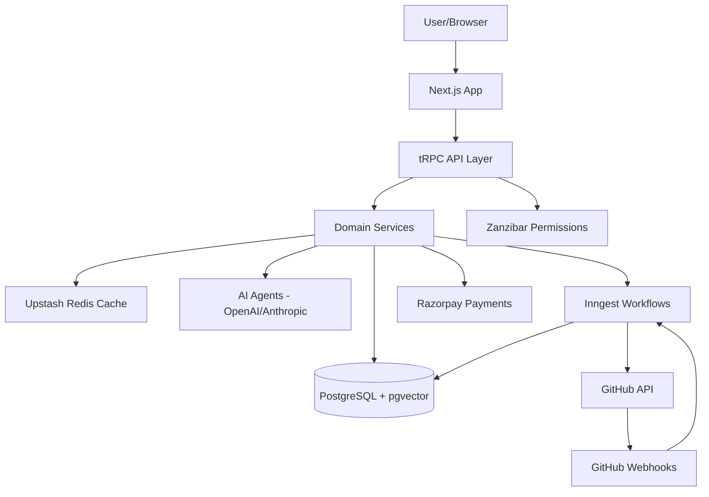

# Alfred — The AI Software Engineer

Alfred is an AI-powered software engineer that helps you manage feature requests, generate PRDs, create tasks, and automate code reviews. It integrates deeply with GitHub to streamline your development workflow.

## Project Overview

Alfred automates the feature lifecycle through five distinct phases:

1.  **Feature Submission & Triage:** Smart suggestion of duplicates and clarification of requirements via an AI agent.
2.  **PRD Generation:** Automated generation of comprehensive Product Requirement Documents.
3.  **Task Management:** Breaking down PRDs into actionable tasks on a Kanban board.
4.  **GitHub Integration:** Automated PR ingestion, description generation, and manual PR linking.
5.  **AI Review Loop:** Continuous AI-powered code reviews with human-in-the-loop approvals.

## Tech Stack

| Category | Technology |
| :--- | :--- |
| **Framework** | [Next.js 15](https://nextjs.org/) (App Router) |
| **Language** | [TypeScript](https://www.typescriptlang.org/) |
| **Monorepo** | [Turborepo](https://turbo.build/) |
| **API Layer** | [tRPC](https://trpc.io/) |
| **Database** | [PostgreSQL](https://www.postgresql.org/) with [Drizzle ORM](https://orm.drizzle.team/) |
| **Auth** | [Better Auth](https://better-auth.com/) |
| **AI** | [Vercel AI SDK](https://sdk.vercel.ai/) (OpenAI / Anthropic) |
| **Workflows** | [Inngest](https://www.inngest.com/) |
| **Styling** | [Tailwind CSS](https://tailwindcss.com/), [Shadcn UI](https://ui.shadcn.com/) |
| **Payments** | [Razorpay](https://razorpay.com/) |
| **Cache** | [Upstash Redis](https://upstash.com/) |
| **Vector Search** | [pgvector](https://github.com/pgvector/pgvector) |

## Architecture



## AI Features

Alfred leverages advanced AI agents for:
- **Clarification Agent:** Interviews the user to refine feature requests.
- **PRD Generation:** Creates detailed specifications from conversations.
- **Task Generation:** Breaks down features into technical tasks.
- **Smart Duplicate Detection:** Finds similar feature requests using vector search.
- **PR Description Auto-generator:** Summarizes code changes into readable PR notes.
- **AI Code Review:** Provides technical feedback on Pull Requests.
- **Release Readiness Check:** Evaluates if a feature is ready for shipping.
- **Auto Changelog Generation:** Compiles shipped features into user-facing updates.
- **Daily Digest:** Personalized summary of project activity.

## Setup Instructions

### Prerequisites
- Node.js 20+
- pnpm 9+
- PostgreSQL with `pgvector` extension
- Redis (Upstash recommended)

### 1. Clone the repository
```bash
git clone https://github.com/your-username/alfred.git
cd alfred
```

### 2. Install dependencies
```bash
pnpm install
```

### 3. Environment Setup
Copy `.env.example` to `.env` and fill in the required values.
```bash
cp .env.example .env
```

### 4. Database Setup
```bash
pnpm db:push
pnpm db:seed
```

### 5. Run the development server
```bash
pnpm dev
```

Visit `http://localhost:3000` to see Alfred in action.

## Environment Variables

See [.env.example](.env.example) for a full list of environment variables and their descriptions.

## Inngest Workflows

Alfred uses Inngest for reliable, event-driven background processing:
- `feature.submitted`: Triggers smart duplicate detection.
- `prd.generate`: Orchestrates the AI PRD generation process.
- `github.webhook`: Handles incoming PR events.
- `review.request`: Initiates AI code review workflows.
- `billing.cycle`: Manages subscription states.

## API Documentation

Interactive API documentation is available at `/docs` when running the application. It is powered by Scalar and generated from our tRPC schemas.

---
Built with ❤️ by the Alfred team.
